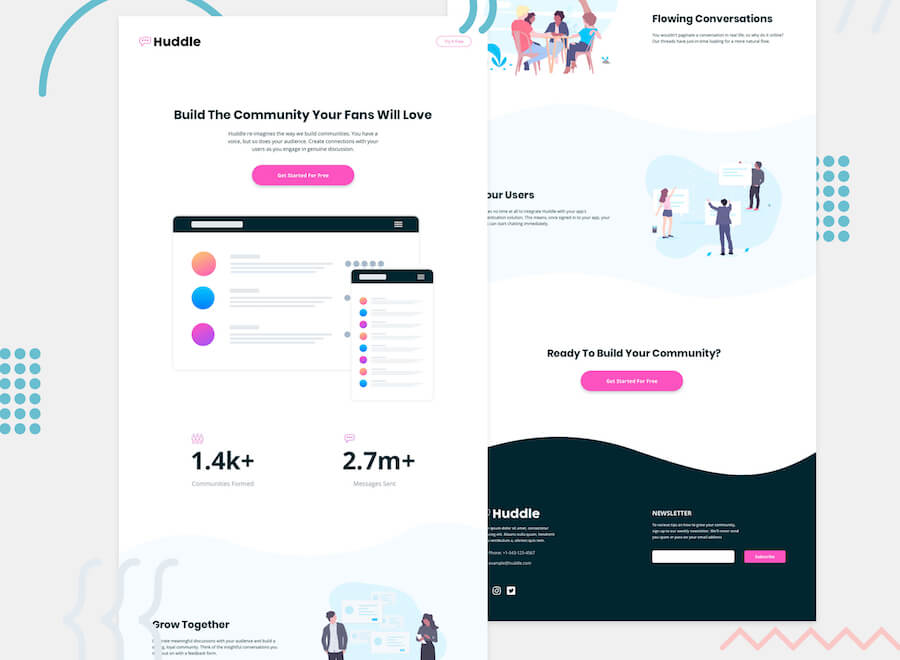
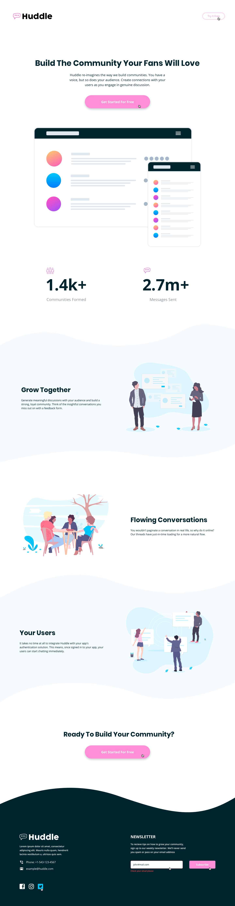

# 🌐 Connectify



**Connectify** is a modern, interactive web project designed to connect users seamlessly. Built with **HTML, CSS, and JavaScript**, this project focuses on clean design, smooth interactions, and responsive layouts.

---

## 🚀 Live Demo
Experience it live: [Connectify Live Demo](https://00mohammad.github.io/Connectify/)

---

## ✨ Features
- 💻 **Responsive Design:** Works flawlessly on **desktop**, **tablet**, and **mobile**.
- 🎨 **Interactive UI:** Smooth animations, transitions, modals, and hover effects.
- 🔍 **Search & Filter:** Easily search through content (notes, items, etc.).
- 🖋 **Custom Fonts & Icons:** Uses **Poppins** font family and **SVG icons** for sharp visuals.
- 🗂 **Organized File Structure:** Clear separation of `CSS`, `JS`, `images`, `fonts`, and `design`.
- ⚡ **Performance Optimized:** Lightweight, fast-loading, and efficient.
- ✅ **User-Friendly:** Intuitive interface with accessible controls.

---

## 🛠 Tech Stack
- **HTML5**
- **CSS3** (Flexbox, Grid, Animations)
- **JavaScript (ES6+)**
- **Git & GitHub** for version control

---

## 📸 Screenshots

### Desktop


### Mobile


### Mockups


---

## 🎥 Demo GIF
  
*If you don't have a GIF, you can record one with a tool like Loom or ScreenToGif.*

---

## 📝 Installation
Clone and run locally:

```bash
# Clone the repository
git clone https://github.com/00mohammad/Connectify.git

# Navigate to the project folder
cd Connectify

# Open index.html in your browser
open index.html

Connectify/
│
├─ index.html
├─ README.md
├─ style/           # CSS files
├─ JavaScript/      # JS files
├─ images/          # Icons and images
├─ fonts/           # Custom fonts
└─ design/          # Mockups, previews, and GIFs

⭐ Show Your Support

If you like this project, give it a ⭐ on GitHub! It motivates me to keep building amazing projects.

📫 Contact

✉ Email: mohammadizi1401@gmail.com

🐱 GitHub: 00mohammad

🔗 LinkedIn: www.linkedin.com/in/mohammad-honarmande-62ab39343
